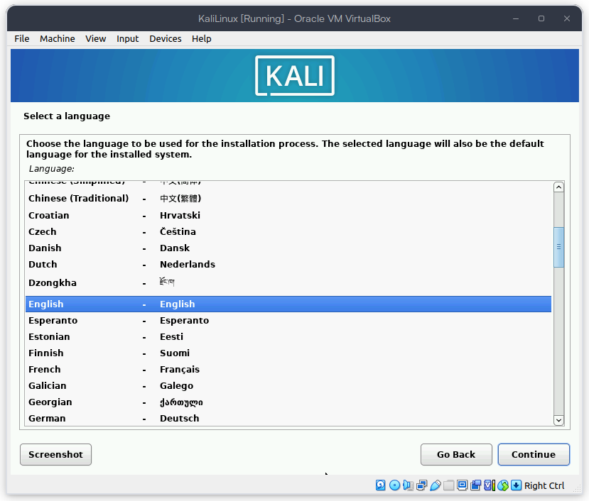
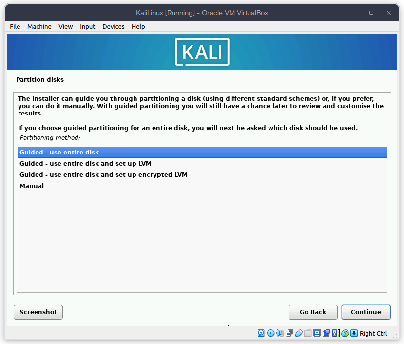

# Instalación de Kali Linux

## Objetivos

- Instalar Kali Linux en una máquina virtual.
- Configurar Kali Linux para que funcione en una red interna.
- Actualizar Kali Linux.
- Hacer un `ping` a la máquina `OPNSense`.

## Actividades

- Descargar la imagen de Kali Linux desde la página oficial.
  - [Kali Linux](https://www.kali.org/get-kali/#kali-installer-images).
- Crear una máquina virtual en VirtualBox.
- Configurar la máquina virtual con las características necesarias.
- Instalar Kali Linux en la máquina virtual.
- Configurar Kali Linux para que funcione en una red interna.

## Instalación de VirtualBox

Para instalar VirtualBox, se debe descargar el instalador desde la página oficial [Virtualbox](https://www.virtualbox.org/).

Esta instalación se debe realizar en la máquina `host`, en particular, este manual se realizó en una máquina con sistema operativo `Pop!_OS 22.04 LTS x86_64`.

- Descargar el instalador de Virtualbox de la página oficial.
  - [Virtualbox](https://www.virtualbox.org/wiki/Linux_Downloads).
- Ejecutar el instalador.

```bash
sudo dpkg -i ~/Downloads/virtualbox-6.1_6.1.32-149290_Ubuntu_bionic_amd64.deb
```

- Seguir las instrucciones del instalador.
  - Ejecutar `sudo apt install -f` si hay dependencias que no están instaladas en la máquina `host`.
- Si el sistema lo requiere, Reiniciar la máquina `host`.

## Descargar la imagen de Kali Linux

Para descargar la imagen de Kali Linux, se debe acceder a la página oficial de Kali Linux y descargar la imagen de la versión deseada.

- [Kali Linux](https://www.kali.org/get-kali/#kali-installer-images).

Para la instalación de Kali Linux, se recomienda descargar la versión `Kali Linux 64-Bit (Installer)` de la imagen para la versión del Sistema operativo del `host`.


Siguiendo la descarga se obtiene un archivo `.iso` que se usará para instalar Kali Linux en la máquina virtual.

## Crear una máquina virtual en VirtualBox

Para crear una máquina virtual en VirtualBox, se realizaron los siguientes pasos:

- Abrir VirtualBox.

- Seleccionar la opción `Nueva` en la pantalla de inicio.

- Configurar la máquina virtual con los siguientes parámetros:
  - Nombre: `KaliLinux`.
  - ISO Image: `kali-linux-2024.2-installer-amd64.iso`, este es el archivo `.iso` que se descargó anteriormente.
  - Tipo: `Linux` Opción por default.
  - Versión: `Ubuntu (64-bit)` Opción por default.


- Configurar la memoria RAM de la máquina virtual.
  - Memoria: `4096 MB`.
  - Procesadores: `2`.


- Configurar el disco duro de la máquina virtual.
  - Disco Duro: `10 GB`.
  - Tipo de disco: `VDI`.
  - Almacenamiento: `Dinámico`.


- Configurar los adaptadores de red en la sección `Network`.
  - Adaptador 2: `Red interna`, este adapatador será la conexión para las máquinas virtuales internamente.
    - Nombre: `intnet`.


- Verificar la configuración de la máquina virtual y seleccionar `Crear`.

- Una vez creada la máquina virtual, seleccionar `Iniciar`.

- Ya que se inicia la maquina virtual se inicia la instalación del Kali Linux.


- Se selecciona el idioma de instalación.



- Se selecciona la configuración del teclado.


- Se inicia a instalación del Sistema Operativo.


- Se configura el hostname


- Se configura el domain


- Se configura el usuario y la contraseña


- Se configura la zona horaria


- Se configura el particionado del disco, como el disco es de 10 GB y propósito es instalarlo ocupando todo el sistema operativo se selecciona `Guided - use entire disk`.



- Se selecciona el disco en el que se instalará el sistema operativo.


- Se confirma la partición, esta partición se realizará en el disco disponible y ocupará todo el espacio, no es necesario realizar cambios.


- Se confirma la escritura de los cambios en el disco.


- Se selecciona la opción de instalar el cargador de arranque en el disco.


- Se inicia la instalación del sistema operativo.


- Para conlcuir la instalación se selecciona el software que se instalará en el sistema operativo. En este case se dejó la configuración por default.


- Se inicia la instalación del software seleccionado.


- Una vez finalizada la instalación se apaga la máquina virtual con el propósito de quitar el disco de instalación del `Boot Order` y se inicia la máquina virtual.


- Se inicia la máquina virtual y se inicia sesión con el usuario y contraseña configurados en la instalación.


- Por último, se verifica la conexión con la máquina `OPNSense` haciendo un `ping` a la dirección IP de la máquina `OPNSense`.

```bash
ping -c 3 192.168.0.1
```

- De igual forma se puede acceder a la interfaz web de `OPNSense` para verificar la conexión.


## Actualizar Kali Linux

Una vez realizada la instalación se puede verificar la configuración de IP que le asignó el servidor DHCP de OPNSense.

```bash
ip a
```


Para actualizar Kali Linux se debe ejecutar el siguiente comando en la terminal.

```bash
sudo apt update && sudo apt upgrade -y
```


Nota: Este proceso es el mismo para la máquina `Kali Linux Purple`.

## Conclusiones

- Se logró instalar Kali Linux en una máquina virtual.
- Se actualizó Kali Linux.
- Se verificó la conexión con la máquina `OPNSense`.
- Esta instalación se realizó en una máquina con sistema operativo `Pop!_OS 22.04 LTS x86_64`, sin embargo, se puede realizar en cualquier sistema operativo que soporte VirtualBox.
- Los pasos para la instalación de Kali Linux puede realizarce de igual manera que con **`Kali Linux Purple`**.

## Recursos

- [Kali Linux Network Installation](https://www.kali.org/docs/installation/hard-disk-install/)
