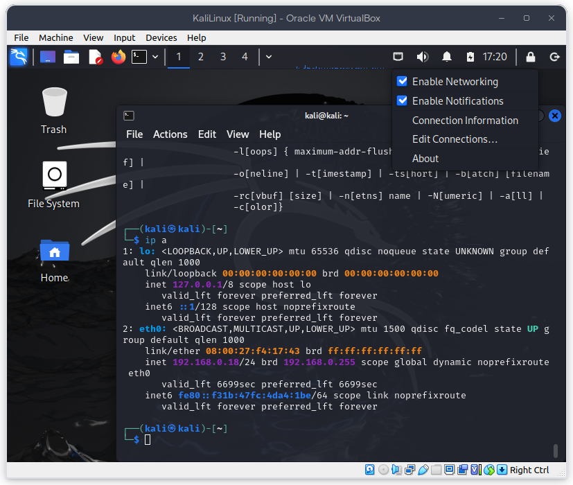
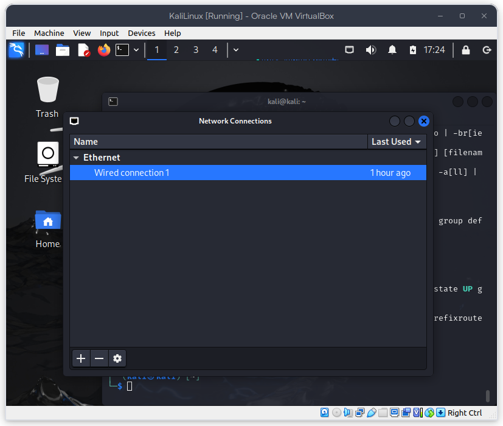
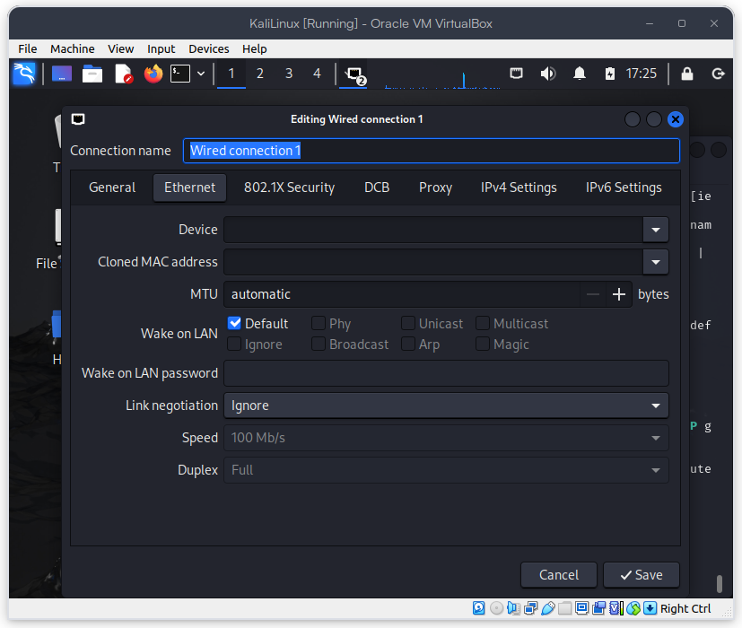
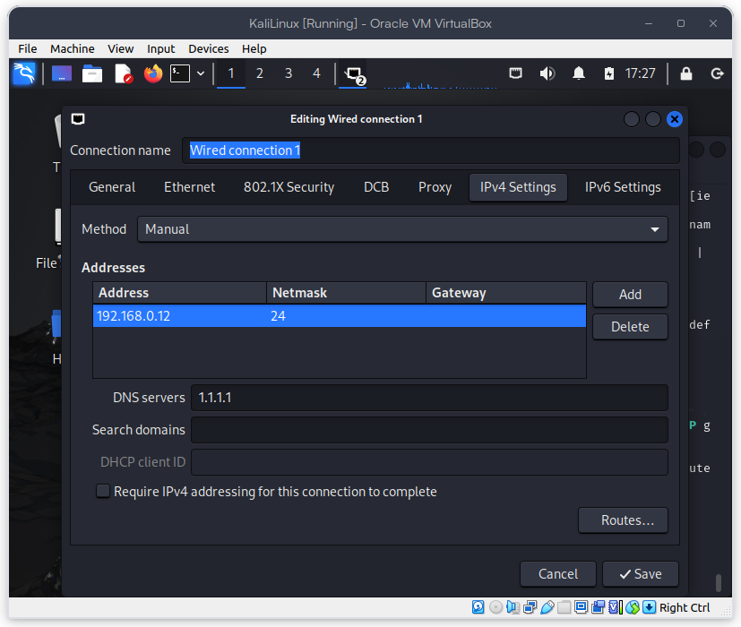
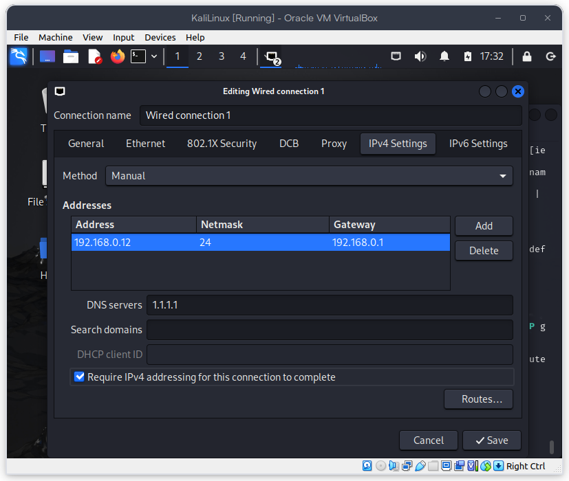
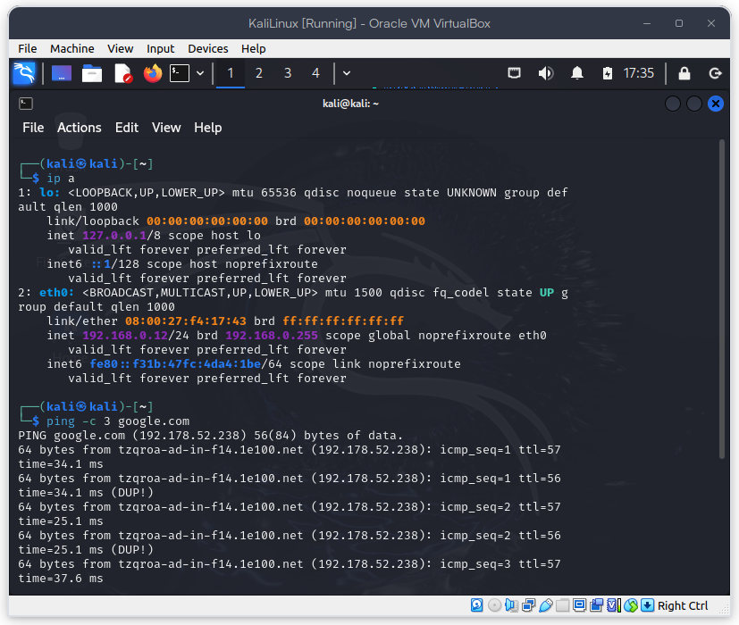
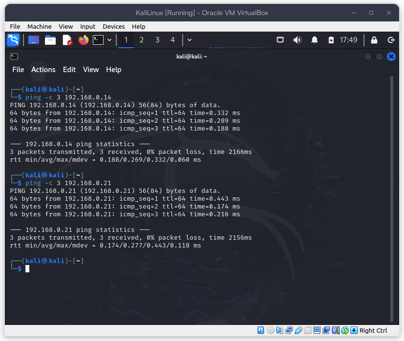

# Configurar IP fija en Kali Linux y Kali-purple

## Objetivos

- Configurar una IP fija en Kali Linux y Kali-purple.

## Actividades

- Configurar una IP fija en Kali Linux y Kali-purple.
- Hacer ping a la IP fija de Kali-purple desde Kali Linux.

### Configuración de la IP fija en Kali Linux desde la interfaz gráfica

- Click derecho en el icono de red en la barra de tareas.
- Seleccionar `Edit Connections`.



- Seleccionar la interfaz de red que se va a configurar.



- Click en `Edit`.



- Seleccionar la pestaña `IPv4 Settings`.

- Cambiar el método de configuración a `Manual`.
  - Agregar la dirección IP: `192.168.0.12`.
  - Agregar la máscara de red: `24`, que es igual a `255.255.255.0`.
  - Agregar la puerta de enlace: `192.168.0.1`.
  - Agregar el servidor DNS: `1.1.1.1`.




- Click en `Save`.

- Se reinicia la interfaz de red para aplicar los cambios.

- Hacer ping al dominio de Google para verificar la conexión a internet.



### Configuración de la IP fija en Kali Linux desde la terminal

- Abrir una terminal en Kali Linux.

- Editar el archivo de configuración de la interfaz de red.

```bash
sudo nano /etc/network/interfaces
```

- Agregar las siguientes líneas al archivo.

```bash
auto eth0
iface eth0 inet static
address 192.168.0.12
netmask 24
gateway 192.168.0.1
dns-nameservers 1.1.1.1
```

- Guardar los cambios y salir del editor.

- Reiniciar la interfaz de red para aplicar los cambios.

```bash
sudo ifdown eth0 && sudo ifup eth0
```

- Hacer ping al dominio de Google para verificar la conexión a internet.

```bash
ping google.com
```

## Ping a la IP fija de Kali-purple desde Kali Linux



- Hacer ping a la IP fija de Kali-purple desde Kali Linux.

```bash
ping 192.168.0.14
```

## Recursos

- [Kali Linux Network Installation](https://www.kali.org/docs/installation/hard-disk-install/)
