# Instalación de Metasploitable

## Objectivos

- Instalar Metasploitable en una máquina virtual.
- Hacer ping hacia el firewall.

## Pre-requisitos

- Tener instalado VirtualBox.
- Tener instalado OPNSense.

## Actividades

- Descargar la imagen de Metasploitable desde la página oficial.
  - [Metasploitable](https://sourceforge.net/projects/metasploitable/files/Metasploitable2/).
- Crear una máquina virtual en VirtualBox.
- Configurar la máquina virtual con las características necesarias.
- Instalar Metasploitable en la máquina virtual.

## Descargar la imagen de Metasploitable

Para descargar la imagen de Metasploitable, se debe acceder a la página oficial de Metasploitable y descargar la imagen de la versión deseada.

- [Metasploitable](https://sourceforge.net/projects/metasploitable/files/Metasploitable2/).

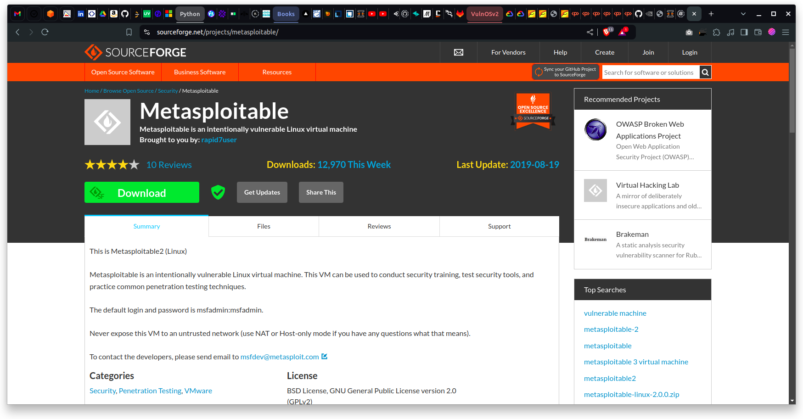

Se descarga un archivo `.zip` que se usará para instalar Metasploitable en la máquina virtual. Este archivo contiene archivos propios para instalarlo en un entorno VMWare, para la instalación en VirtualBox se debe descomprimir el archivo y seleccionar el archivo `.vmdk` que se encuentra en la carpeta `Metasploitable2`.

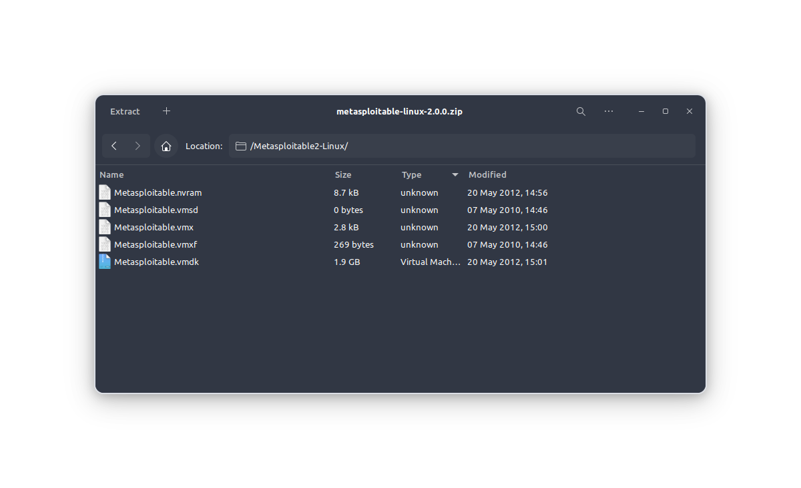

Para la instalación de Metasploitable, se va a crear una máquina virtual en VirtualBox con las siguientes características:

- Nombre: `Metasploitable`.
- ISO Image: Esta opción no se selecciona ya que el archivo `.zip` no tiene una inagen `.iso`.
- Tipo: `Linux`.
- Versión: `Linux 2.6/3.x/4.x/5.x (64-bit)`.

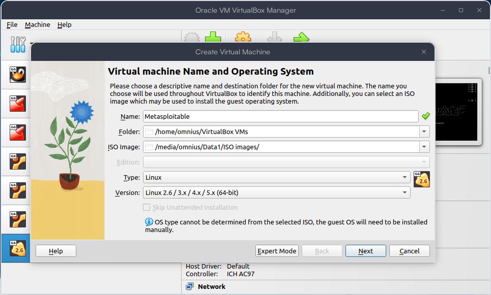

- Se configura la memoria RAM de la máquina virtual.
  - Memoria: `2048 MB`, el requerimiento mínimo es 1024.
  - Procesadores: `2`, el requerimiento mínimo es 1.

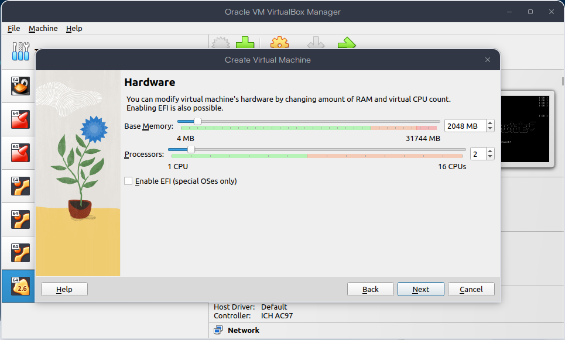

- Se configura el disco duro de la máquina virtual.
  - Tipo de archivo: `VDI (VirtualBox Disk Image)`.
  - Almacenamiento: `Dinámico asignado`.
  - Tamaño: `8 GB`, el requerimiento mínimo es 8.

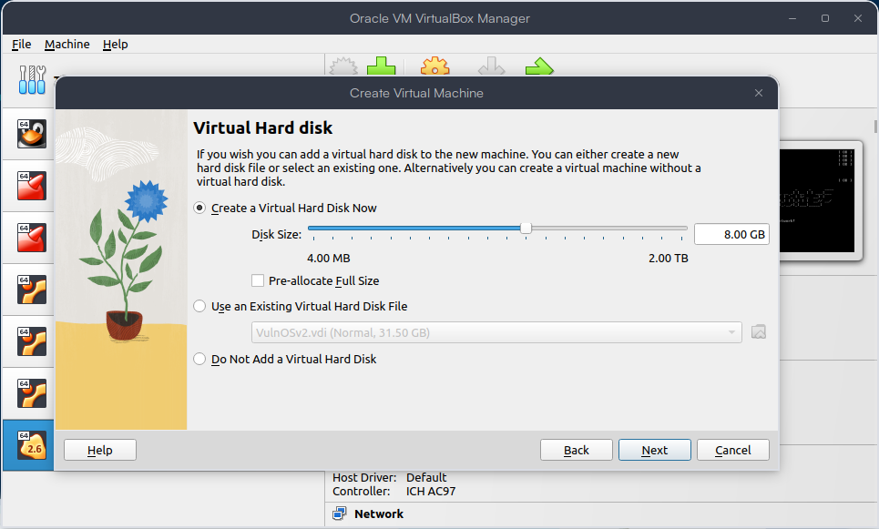

- Se valida la configuración de la máquina virtual y se selecciona la opción `Crear`.

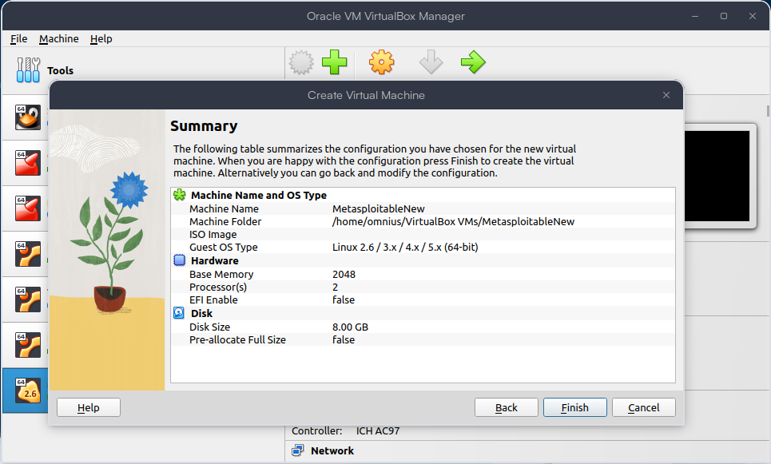

- En la `Configuración` de la máquina virtual, se selecciona la opción `Sistema` y se selecciona únicamente la opción `HDD`.

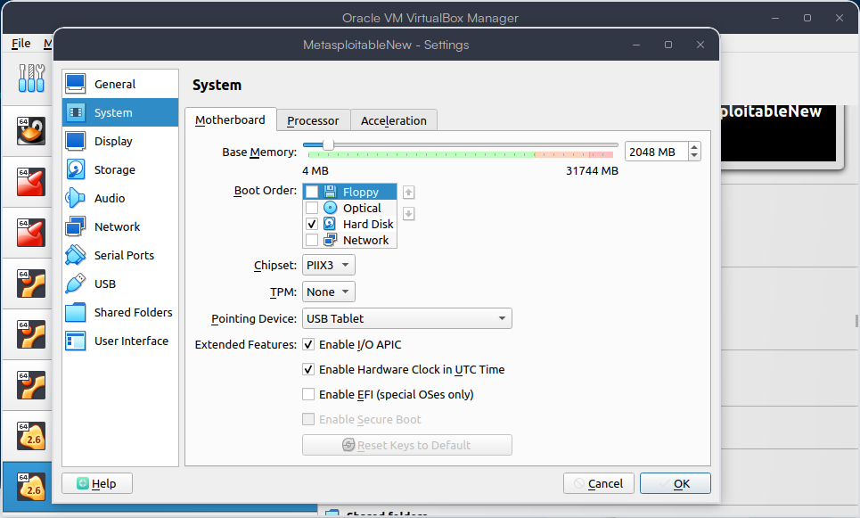

- En la `Configuracion` de la máquina virtual, se selecciona la opción `Almacenamiento` y se selecciona el disco duro de la máquina virtual, esta tiene uan opción de `Atributos -> Disco duro` donde se selecciona el archivo `.vmdk` que se descomprimió anteriormente, es decir, reemplazar el disco duro que se creó por el disco duro de `Metasploitable2`

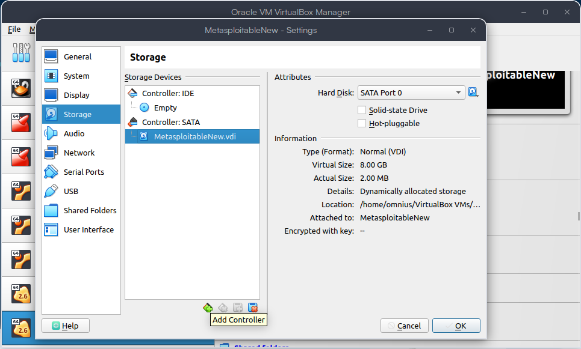

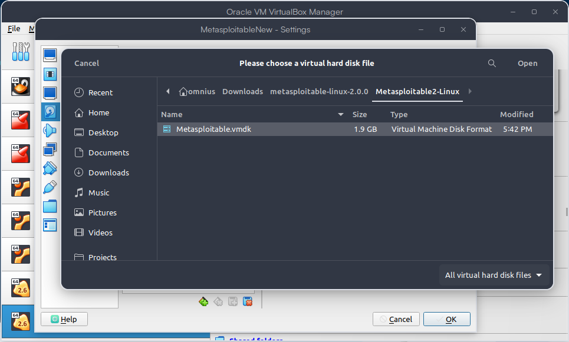

- En la `Configuración` de la máquina virtual, se selecciona la opción `Red` y se configura de la siguiente manera:
  - Adaptador 1:
    - Habilitar la opción `Adaptador 1`.
    - Tipo: `Red interna`.
    - Nombre: `intnet`.

Esto con el fin de que la máquina virtual de Metasploitable no tenga comunicación con el exterior ya que es una máquina vulnerable.

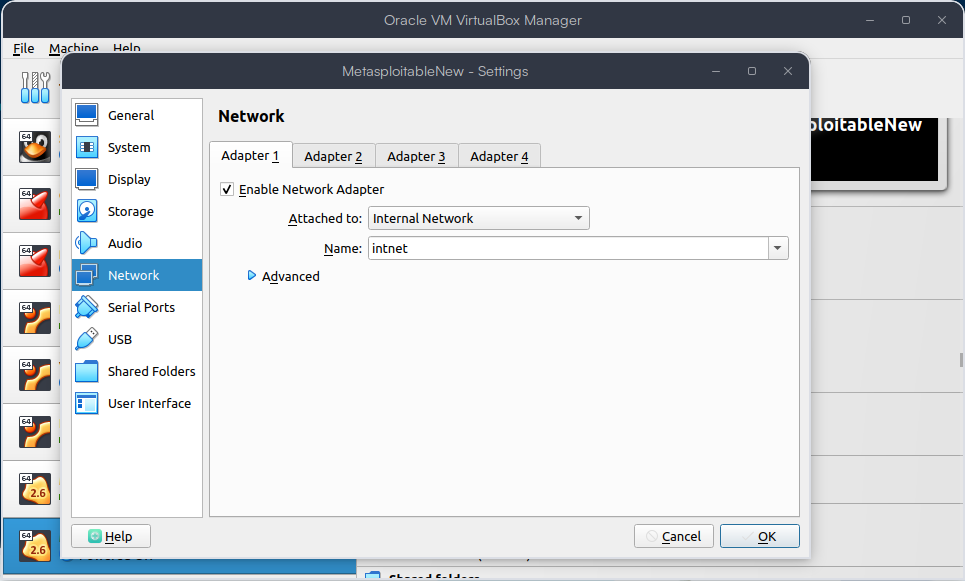

- Se inicia la máquina virtual, no es necesaria la instalación ya que esta viene instalada en el disco duro que se seleccionó anteriormente.

- Se inicia sesión en la máquina virtual con el usuario `msfadmin` y la contraseña `msfadmin`.

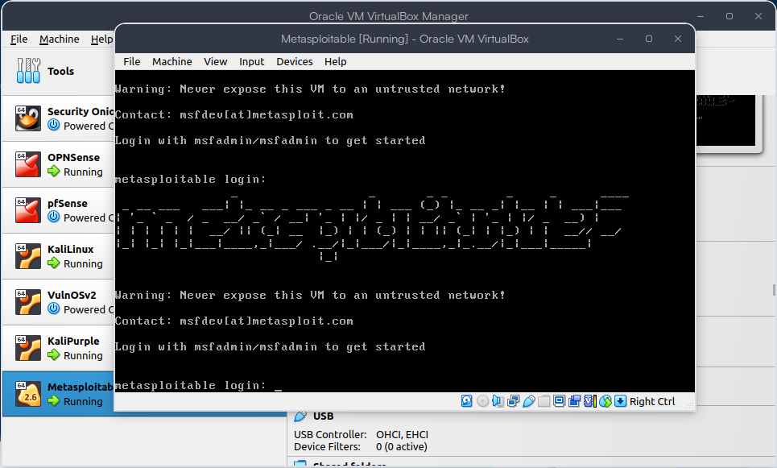

- Se hace `ping` hacia el firewall para verificar la comunicación.

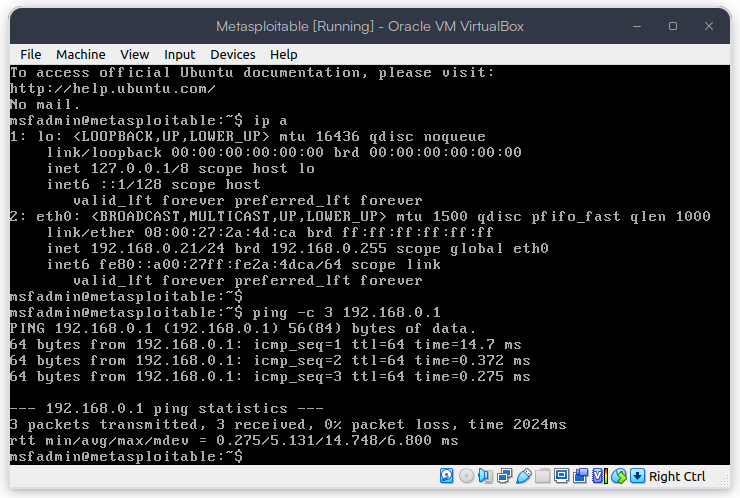

## Recursos

- [Metasploitable](https://sourceforge.net/projects/metasploitable/files/Metasploitable2/).
- [Metasploitable Docs](https://docs.rapid7.com/metasploit/metasploitable-2).
