# Instlación de OPNSense

## Objetivos

- Instalar OPNSense en una máquina virtual.
- Configurar OPNSense para que funcione como firewall.

## Actividades

- Descargar la imagen de OPNSense desde la página oficial.
  - [OPNSense](https://opnsense.org/download/).
- Crear una máquina virtual en VirtualBox.
- Configurar la máquina virtual con las características necesarias.
- Instalar OPNSense en la máquina virtual.
- Configurar OPNSense para que funcione como firewall.

## Instalación de VirtualBox

Para instalar VirtualBox, se debe descargar el instalador desde la página oficial [Virtualbox](https://www.virtualbox.org/).

Esta instalación se debe realizar en la máquina `host`, en particular, este manual se realizó en una máquina con sistema operativo `Pop!_OS 22.04 LTS x86_64`.

- Descargar el instalador de Virtualbox de la página oficial.
  - [Virtualbox](https://www.virtualbox.org/wiki/Linux_Downloads).
- Ejecutar el instalador.

```bash
sudo dpkg -i ~/Downloads/virtualbox-6.1_6.1.32-149290_Ubuntu_bionic_amd64.deb
```

- Seguir las instrucciones del instalador.
  - Ejecutar `sudo apt install -f` si hay dependencias que no están instaladas en la máquina `host`.
- Si el sistema lo requiere, Reiniciar la máquina `host`.

## Descargar la imagen de OPNSense

Para descargar la imagen de OPNSense, se debe acceder a la página oficial de OPNSense y descargar la imagen de la versión deseada.

- [OPNSense](https://opnsense.org/download/).

Para la instalación de OPNSense, se recomienda descargar la versión `AMD64` de la imagen para la versión del Sistema operativo del `host` y la siguiente configuración.

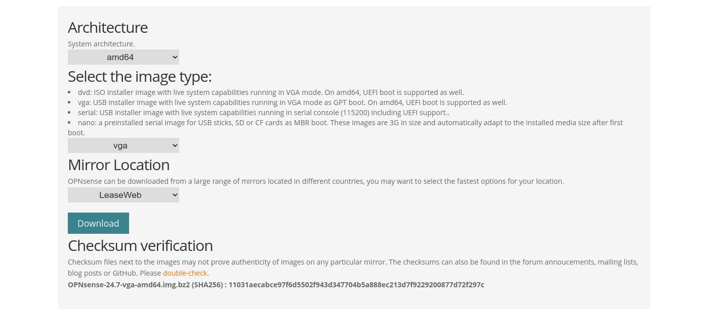

Siguiendo la descarga se obtiene un archivo `.iso` que se usará para instalar OPNSense en la máquina virtual.

## Crear una máquina virtual en VirtualBox

Para crear una máquina virtual en VirtualBox, se realizaron los siguientes pasos:

- Abrir VirtualBox.

- Seleccionar la opción `Nueva` en la pantalla de inicio.


- Configurar la máquina virtual con los siguientes parámetros:
  - Nombre: `OPNSense`.
  - ISO Image: `OPNSense-24.1-dvd-amd64.iso`, este es el archivo `.iso` que se descargó anteriormente.
  - Tipo: `BSD`.
  - Versión: `FreeBSD (64-bit)` u `OpenBSD (64-bit)`.

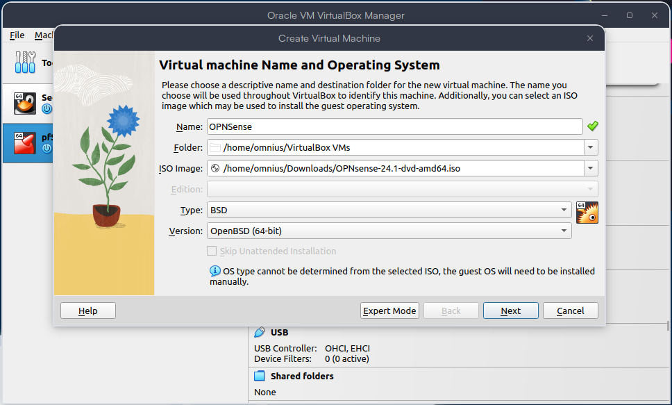

- Configurar la memoria RAM de la máquina virtual.
  - Memoria: `2048 MB`, este es el requerimiento mínimo.
  - Procesadores: `2`, el requerimiento mínimo para una máquina virtual.

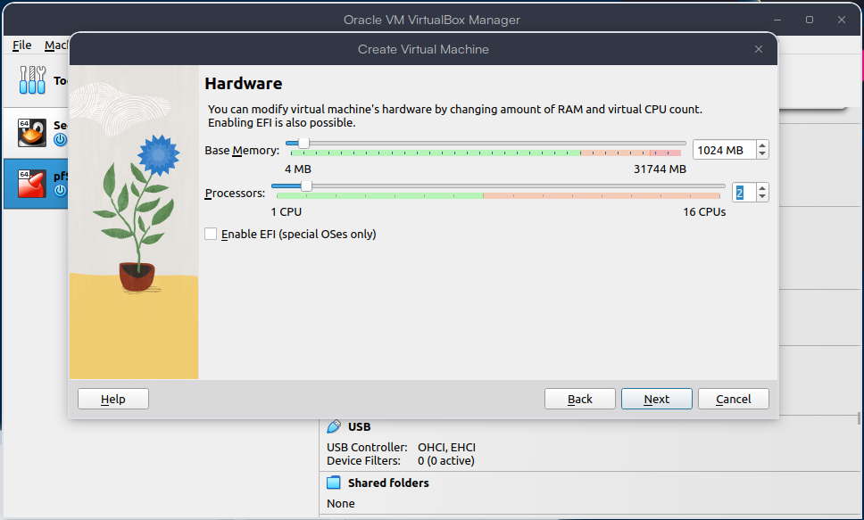

- Configurar el disco duro de la máquina virtual.
  - Disco duro: `Crear un disco duro virtual ahora`.
  - Tipo de disco duro: `VDI`.
  - Almacenamiento: `Dinámico`.
  - Tamaño: `8 GB`.

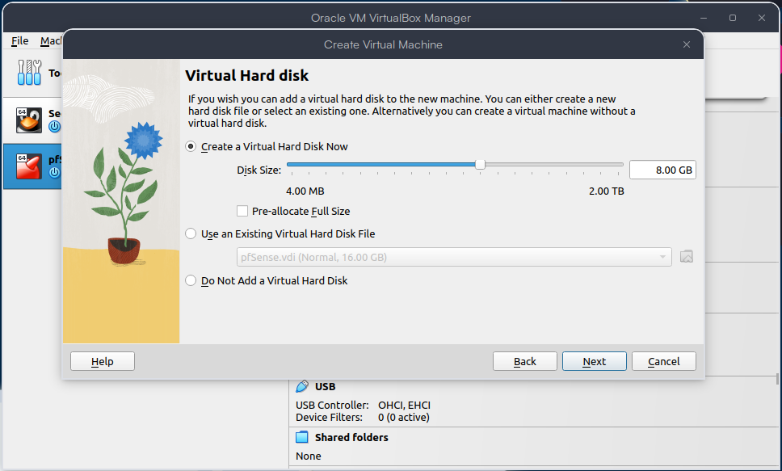

- En la sección `Display`, configurar los recursos de display (Opcional).
  - Memoria de video: `128 MB`.


- En la sección `Storage`, verificar que la imagen se haya reconocido y montado como un dispositivo óptico.

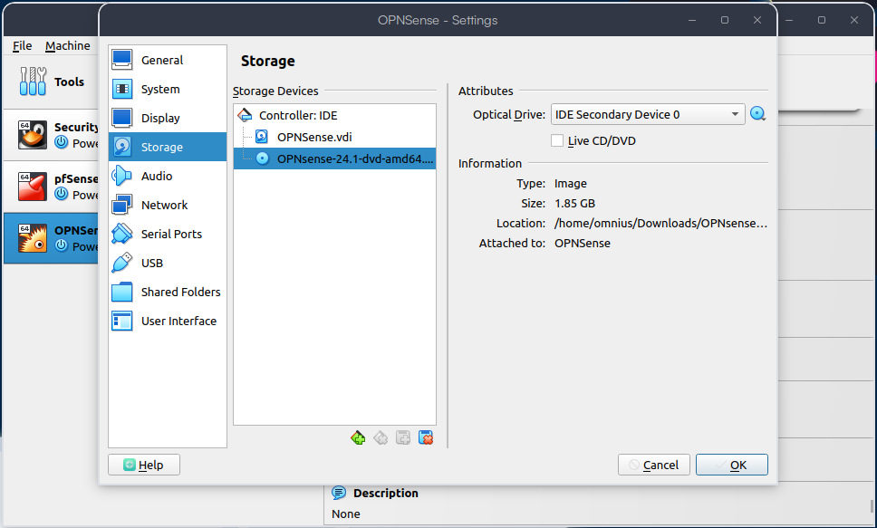

- En la sección `Network`, configurar la red de la máquina virtual.
  - Adaptador 1: `NAT`, este adaptador será la conexión con el exterior(`Internet`).
  - Adaptador 2: `Red interna`, este adapatador será la conexión para las máquinas virtuales internamente.
    - Nombre: `intnet`.

| Adaptador 1 | Adaptador 2 |
| ----------- | ----------- |
| 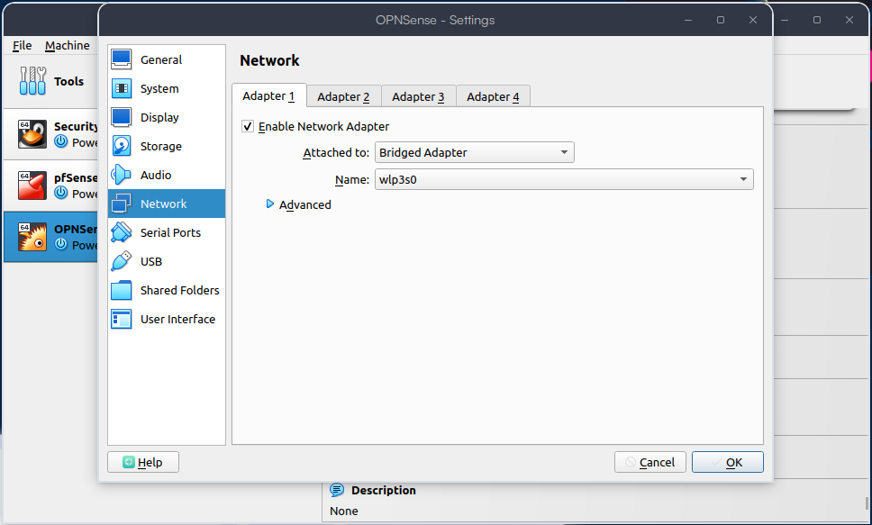 | 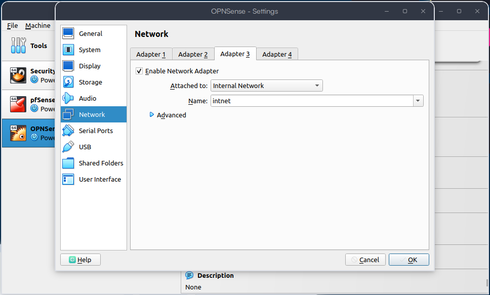 |

- Verificar la configuración de la máquina virtual y seleccionar `Crear`.

- Una vez creada la máquina virtual, seleccionar `Iniciar`.

- Una vez iniciada la máquina virtual, el sistema pedirá un usuario y contraseña para continuar la instalación, estas credenciales ya viene por default y solo se ocuparán en el proceso de instalación.
  - login: **installer**
  - password: **opnsense**

- Seleccionar la opción `Install OPNSense`.

- Seleccionar el keyboard layout, en este caso se seleccionó la opción por default `Continue with default keymap`.

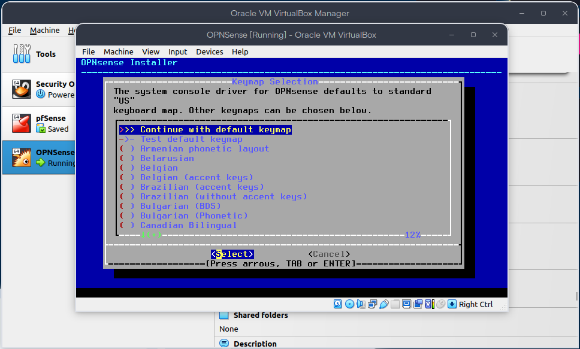

- Seleccionar el modo de instalación, en este caso se seleccionó la opción por default `Install (UFS)`.

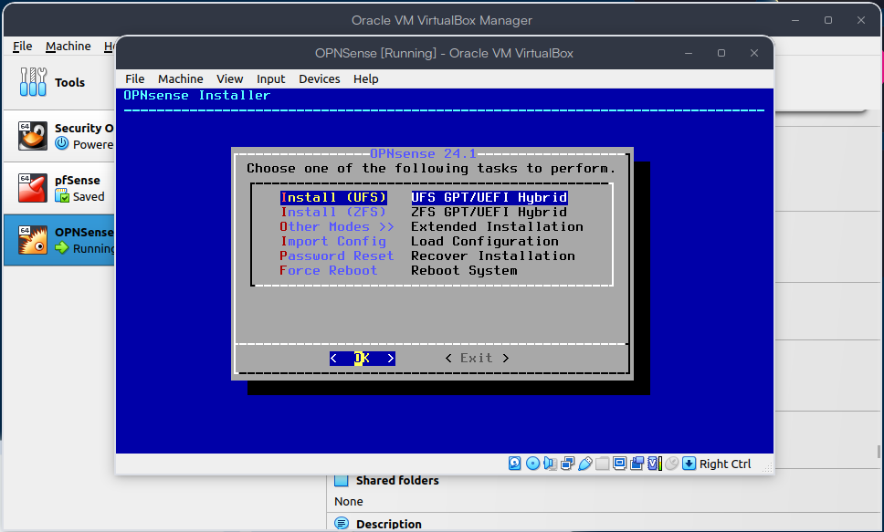

- Seleccionar el disco duro donde se instalará OPNSense, en este caso se seleccionó el disco duro `ada0`.

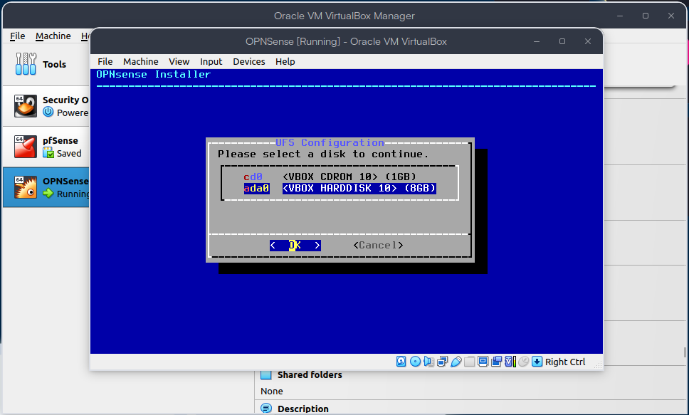

- En la configuración final se requiere cambiar la contraseña del usuario `root`.

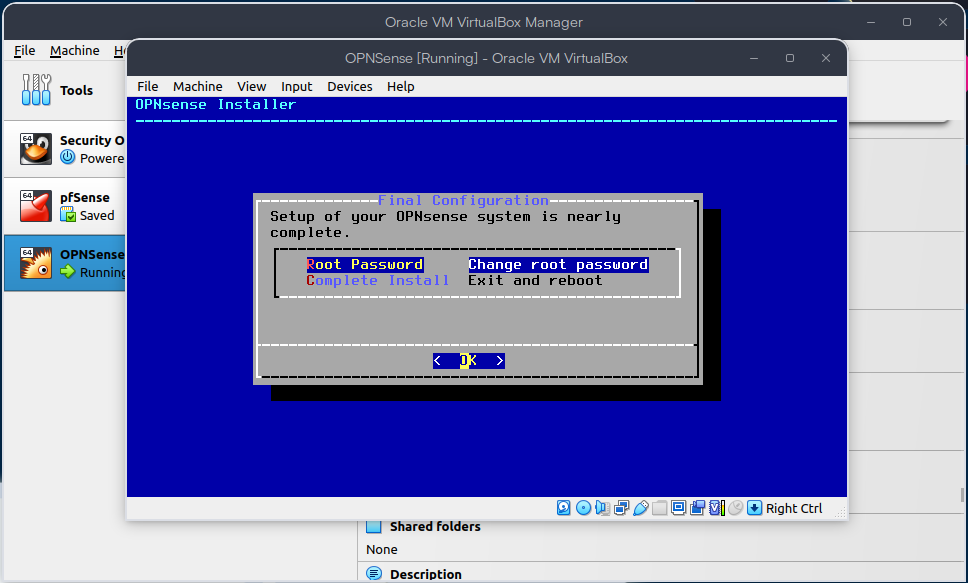

- Posterior a este cambio de contraseña, se debe seleccionar la opción `Reboot`.

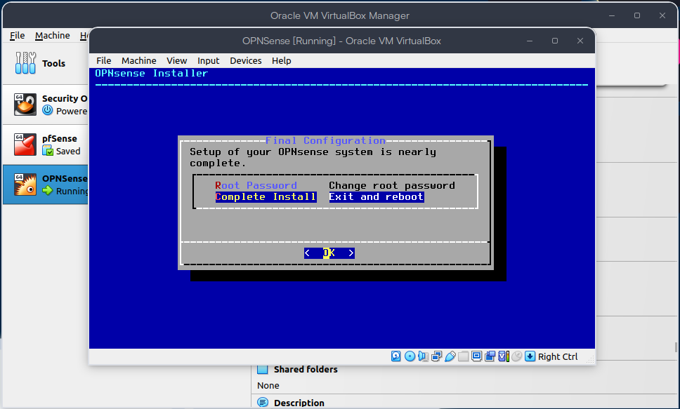

- Una vez reiniciada la máquina virtual, el Sistema Operativo identifica de forma automática los dos adaptadores de red que configuramos al inicio y se procede a configurar la interfaz de red.

- Seleccionar la opción `Assign interfaces` y se configuran las interfaces de red. Este paso es opcional, pero se recomienda hacerlo para tener un mejor control de las interfaces de red.

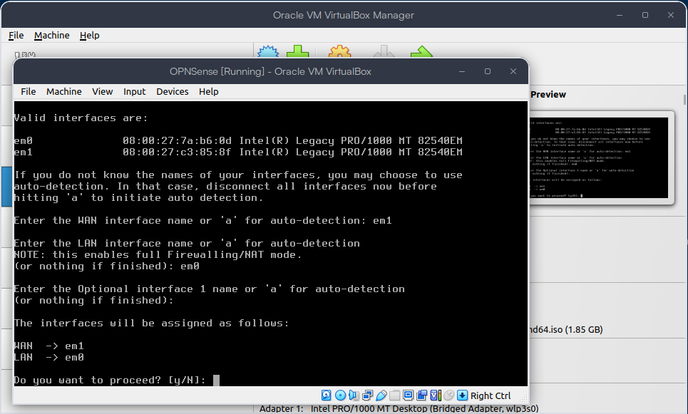

- Configurar la interfaz de red WAN.
  - Se muestran las interfaces de red disponibles.
    - `em1`: Adaptador WAN.
    - `em0`: Adaptador LAN.
  - Seleccionar la interfaz de red que se configurará.
    - En este caso se seleccionó la interfaz `em1`.
  - Configurar la interfaz de red IPv4.
    - `IPv4 Address`: `192.168.1.100`.
    - `IPv4 Subnet mask`: `24`.
    - `Gateway`: `192.168.1.1`. Es el gateway del modem del proveedor de internet.


- Se configura el DNS y otras configuracioni que se omitiran en este manual.
  - `DNS Servers`: `1.1.1.1` Cloudflare DNS.


- Configurar la interfaz de red LAN.
  - Se muestran las interfaces de red disponibles.
    - `em1`: Adaptador WAN.
    - `em0`: Adaptador LAN.
  - Seleccionar la interfaz de red que se configurará.
    - En este caso se seleccionó la interfaz `em0`.
  - Configurar la interfaz de red IPv4.
    - `IPv4 Address`: `192.168.0.1`.
    - `IPv4 Subnet mask`: `24`.
    - `Gateway`: ``.

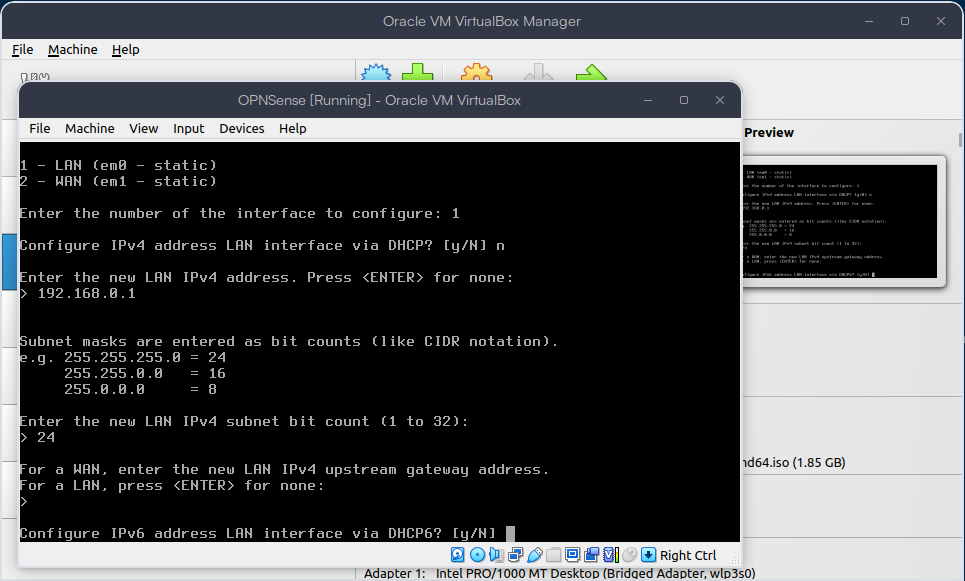

- Nuevamente se omiten las configuraciones Ipv6 y otras configuraciones.
- Se configuran los rangos de IP para el DHCP.
  - `Range from`: `192.168.0.10`.
  - `Range to`: `192.168.0.254`.


- Con esto se finaliza la configuración de las interfaces de red.

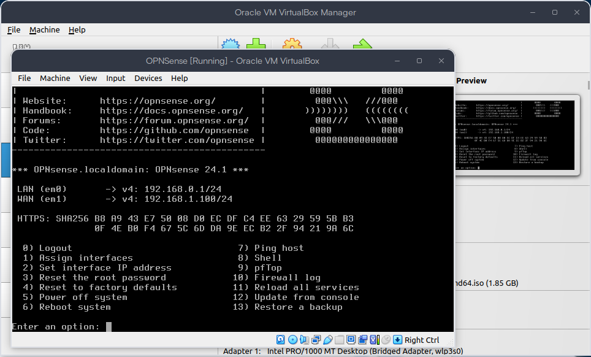
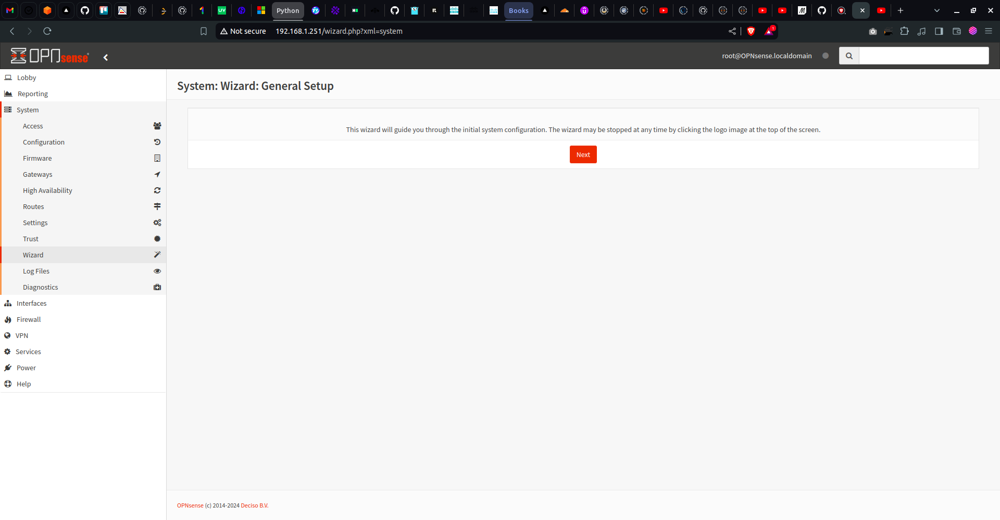
  