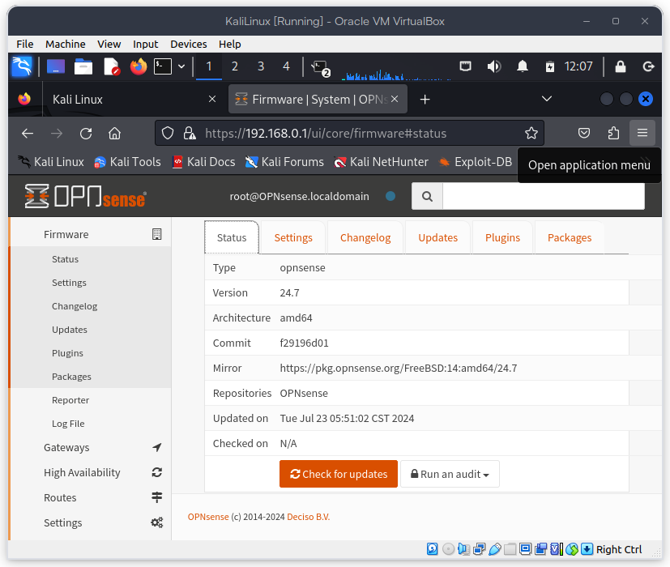

# Configuración de OPNSense

## Objetivos

- Verificar la configuración de la red en OPNSense para que funcione como firewall.
- Acceder a la interfaz web de OPNSense.

## Pre-requisitos

- Tener instalado OPNSense en una máquina virtual, ver la instalación de [OPNSense](./opnSenseInstallation.md).
- Tener configurada la red en OPNSense.
- Tener acceso a la interfaz web de OPNSense a traves de otra maquina virtual con la red configurada, en este caso, Kali (Ver la instalación de [Kali Linux](../kali/kaliInstallation.md)).

## Actividades

- Acceder a la interfaz web de OPNSense.
- Verificar la configuración de la red en OPNSense.
- Actualizar OPNSense.

## Acceder a la interfaz web de OPNSense

Para acceder a la interfaz web de OPNSense, se deben seguir los siguientes pasos:

- Abrir un navegador web.
- Escribir la dirección IP de OPNSense, en este caso `192.168.0.1`.
- Ingresar las credenciales de acceso.
  - Usuario: `root`.
  - Contraseña: `password`, esta es la contraseña que se configuró en la instalación de OPNSense.

- En la parte superior derecha, se puede ver el menú de configuración de OPNSense.

- Al iniciar sesión, se mostrará la pantalla de inicio de OPNSense con una guía de configuración inicial.

## Verificar la configuración de la red en OPNSense

Para verificar la configuración de la red en OPNSense, se deben seguir los siguientes pasos:

- El siguiente paso en la guía de configuración inicial es la configuración de la interfaz `WAN` y se mostrará la siguiente pantalla, esta pantalla tiene una configuración que refleja los cambios realizados en la [Instalación de OPNSense](./opnSenseInstallation.md).

  - Opcionalmente, se puede cambiar la configuración de la interfaz `WAN` si se desea. En este caso se añadió un DNS secundario `8.8.8.8` que es el DNS secundario de Google.

.png)

- Se continúa con la configuración de la zona horaria.

  - Opcionalmente, se puede cambiar la configuración de la zona horaria si se desea. En este caso se seleccionó la zona horaria `America/Mexico_City`.

.png)

- Se continúa con la configuración de IP.

  - Opcionalmente, se puede cambiar la configuración de la IP si se desea.

.png)

- Se continúa con la configuración de la interfaz `LAN`, en esta pantalla se puede ver la configuración de la interfaz `LAN` que se realizó en la [Instalación de OPNSense](./opnSenseInstallation.md).

  - Opcionalmente, se puede cambiar la configuración de la interfaz `LAN` si se desea.

.png)

- Se continúa con la configuración de la contraseña del usuario `root`.

  - Opcionalmente, se puede cambiar la contraseña del usuario `root` si se desea.

.png)

- Si todo se configuró correctamente, se reinicia OPNSense.

.png)

## Actualizar OPNSense

Una vez que se ha verificado la configuración de la red en OPNSense y se haya realizada la configuración inicial, se puede proceder a actualizar OPNSense dando clic en el botón `Buscar actualizaciones` al final de la pantalla de inicio.

.png)

- Esta pantalla de actualización muestra la versión actual de OPNSense y la versión más reciente disponible.

- Para actualizar OPNSense, se debe dar clic en el botón `Actualizar`, esto descargará e instalará la versión más reciente de OPNSense y los paquetes necesarios.

- Una vez que se haya actualizado OPNSense, se mostrará un mensaje de confirmación.

## Recursos

- [OPNSense Documentation](https://docs.opnsense.org/setup.html).
- ´OPNsense - Instalación básica paso a paso´, [YouTube](https://www.youtube.com/watch?v=3J9Q6J1J9Zo).
